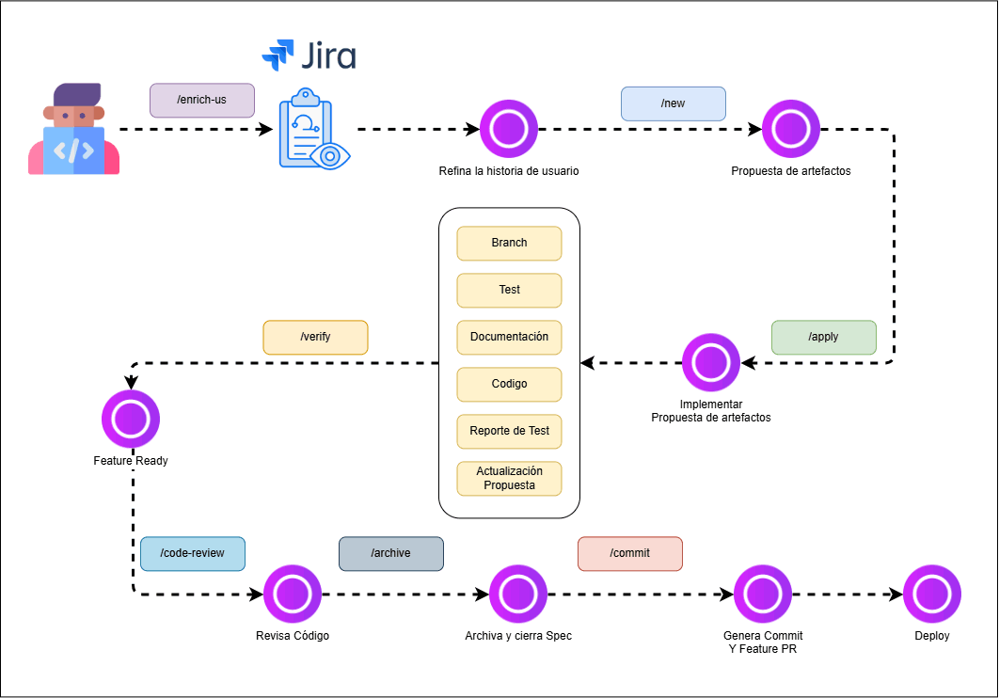

# AI Engineering Harness

An opinionated, spec-driven harness for building software with an AI coding agent (Claude Code, Cursor, or any compatible LLM tool) as a first-class collaborator — not just an autocomplete.

It turns "ask the agent to do X" into a repeatable pipeline with checkpoints: every change goes from a Jira story to a reviewed, documented, tested pull request through the same sequence of commands, and a set of hooks mechanically enforces the checkpoints that matter (build, tests, code review, documentation) instead of relying on the agent — or a human — remembering to run them.

This repository is both:
- a **working project** (`backend/`) using the harness day to day, and
- the **source of the harness itself** (`ai-specs/`, `.claude/`, `.cursor/`, `openspec/`), reusable in any other project via [`packages/specboot`](packages/specboot).

## Table of Contents

- [Why this exists](#why-this-exists)
- [How it's organized](#how-its-organized)
  - [The symlink pattern, in detail](#the-symlink-pattern-in-detail)
- [Commands, skills, and hooks — how they fit together](#commands-skills-and-hooks--how-they-fit-together)
- [The workflow](#the-workflow)
  - [A worked example, ticket to PR](#a-worked-example-ticket-to-pr)
- [The gates (mechanical enforcement)](#the-gates-mechanical-enforcement)
- [OpenSpec](#openspec)
- [Jira integration](#jira-integration)
- [MCP servers and portability to other LLM tools](#mcp-servers-and-portability-to-other-llm-tools)
- [CI](#ci)
- [Getting started](#getting-started)
  - [Working in this repo](#working-in-this-repo)
  - [Bootstrapping a new project with specboot](#bootstrapping-a-new-project-with-specboot)
- [Repository layout](#repository-layout)
- [Extending the harness](#extending-the-harness)

## Why this exists

A capable LLM is not, by itself, a reliable engineering process. Without structure:

- the quality of an AI-assisted change depends on how well the prompt was written that day;
- nothing guarantees a change was actually reviewed, tested, or documented before it's committed;
- knowledge of "how we do things here" lives in a person's head, not in the repo.

This harness addresses that by giving the agent (and the human directing it) a **process layer**: reusable commands for each stage of a change, a **spec layer** ([OpenSpec](https://github.com/Fission-AI/OpenSpec)) that produces a written, reviewable plan before any code is written, and an **enforcement layer** of git hooks that block the workflow when a required step didn't actually happen.

## How it's organized

Everything reusable across coding agents lives in one canonical place: **`ai-specs/`**. Agent-specific folders (`.claude/`, `.cursor/`) never hold their own copy of an agent, skill, command, or hook — they hold a **symlink** pointing back into `ai-specs/`. This is a hard rule for this repo (see `CLAUDE.md`, section 5), not a style preference: write a skill once, and it works identically whether you're driving the harness from Claude Code or from Cursor, because both are reading the exact same file on disk.

```
ai-specs/
├── agents/       # Specialized agent personas (backend-developer, ...)
├── commands/     # Slash commands: /new, /apply, /verify, /archive, _preconditions.md
├── skills/       # Reusable workflows: enrich-us, commit, update-docs, ...
└── hooks/        # Node scripts enforcing the gates below, wired via .claude/settings.json

.claude/          # agents/skills/commands/hooks -> symlinks into ai-specs/, plus settings.json (real file)
.cursor/          # same symlinks, for Cursor
```

`CLAUDE.md`, `AGENTS.md`, `codex.md`, and `GEMINI.md` at the repo root are themselves symlinks to `docs/base-standards.md` — one file, read under four different names, so every agent flavor sees the same project conventions.

### The symlink pattern, in detail

**What actually gets symlinked, and what doesn't:**

| Lives under `.claude/` and `.cursor/` as... | How |
|---|---|
| `agents/<name>.md`, `skills/<name>/`, `commands/<name>.md` | One symlink per entry, pointing at `../../ai-specs/<kind>/<name>` |
| `hooks/<name>.js`, `hooks/lib/` | Same pattern — added for consistency, even though nothing currently reads hooks from this location (see caveat below) |
| `settings.json` | **Not** a symlink — it's a real, per-project file (it has to be, since hooks reference paths and each project's hooks live in its own `ai-specs/hooks/`) |
| OpenSpec's own generated commands (`.claude/commands/opsx/*.md`, `.cursor/commands/opsx-*.md`) | **Not** symlinked — deliberately left as separate native files per tool, because their frontmatter format and even file-naming convention differ between Claude Code and Cursor. Forcing a symlink here would break whichever tool didn't generate that exact format. |
| `docs/frontend-standards.md` | **Copied**, not symlinked — it's chosen once (React or Vue, see below) and becomes that project's own document to edit going forward, not a live link back to a shared template |

**Why hooks are symlinked into `.claude/hooks/` even though nothing needs them there:** `.claude/settings.json` invokes hook scripts by their real path (`node ai-specs/hooks/gate-git.js`), not by looking inside a `.claude/hooks/` folder — so functionally, nothing reads from there today. The mirror exists purely so `ai-specs/` stays the *only* place in the repo without a symlinked counterpart under `.claude/`/`.cursor/`, matching the "everything canonical has a visible mirror" convention used everywhere else.

**The Windows / git caveat this pattern has to survive:** a real OS-level symlink is created with `fs.symlinkSync()` (in `packages/specboot/bin/init.js`), not with a shell `ln -s` — on Windows without symlink privileges, `ln -s` silently *copies* the file instead of linking it, which defeats the whole point. Separately, when git's own `core.symlinks` setting is `false` (common on Windows checkouts), git checks out a tracked symlink as a **plain text file whose only content is the relative target path** instead of a real symlink. `init.js`'s `createSymlink()` function detects exactly this case — a file (not a symlink) whose content equals the intended target — and repairs it into a real symlink. This is why re-running `specboot init` against an already-cloned project is safe and idempotent even on a machine that checked the repo out without real symlinks.

## Commands, skills, and hooks — how they fit together

These three live in `ai-specs/` but play different roles, and the distinction matters when you're extending the harness:

- **Commands** (`ai-specs/commands/*.md`) are the user-facing entry points — what you actually type: `/new`, `/apply`, `/verify`, `/archive`. Each is a short markdown file whose main job is orchestration: state the expected arguments, apply the relevant precondition(s) from `_preconditions.md`, and delegate the real work to a skill.
- **Skills** (`ai-specs/skills/<name>/SKILL.md`) are the detailed, reusable "how-to" procedures a command invokes — or that get invoked directly by name/description without a slash command at all (e.g. `commit`, `update-docs`, `enrich-us`). `/new` itself is a thin wrapper around the `openspec-propose` skill; `/apply` wraps `openspec-apply-change`.
- **Hooks** (`ai-specs/hooks/*.js`) are the one layer that isn't "instructions for the agent to follow" — they're plain deterministic Node scripts that Claude Code itself executes automatically, wired via `.claude/settings.json`, intercepting a specific tool call (`Bash`, a slash-command prompt, or `ReportFindings`) regardless of what the agent intended to do next.

So the practical flow for, say, `/archive` is: **command** (`archive.md`) states the precondition → that precondition is Gate B/C, described in `_preconditions.md` → but the gate is actually *enforced* by a **hook** (`gate-archive.js`) that runs the instant you submit `/archive`, independent of whether the command file's instructions were followed faithfully that turn.

## The workflow

```
Jira story
   │
   ▼
/enrich-us          Refine a Jira ticket into an implementation-ready story
   │
   ▼
/new                Generate OpenSpec artifacts: proposal, design, specs, tasks
   │                (Gate A: won't let /apply run without this)
   ▼
/apply               Implement the tasks; auto-updates docs when code changes require it
   │
   ▼
/verify              Re-check build, tests, and task completion
   │
   ▼
/code-review          Review the diff; findings are persisted per-change
   │
   ▼
/archive              Close out the OpenSpec change, promote specs
   │                 (Gate B + C: blocked if build/tests are red or findings are unresolved)
   ▼
commit                Stage, commit, push, open the PR
   │                 (Gate B + C + D: same checks, plus doc-sync verification)
   ▼
Deploy
```

`ai-specs/commands/_preconditions.md` documents the gates referenced by several commands, so the rule for "when can I archive?" lives in one place, not copy-pasted across files.

### A worked example, ticket to PR

Concrete invocations for a fictional ticket `VN-3878` ("acquire and cache an Azure B2C access token"), taken directly from each command/skill's own documented usage:

```
/enrich-us VN-3878
```
Pulls the ticket via the Jira MCP, checks whether it already has enough technical detail (endpoints, fields, error handling, non-functional requirements), and — if not — writes the enriched version back to the same Jira ticket under `[original]`/`[enhanced]` sections.

```
/new VN-3878 create-auth-services
```
Reads the (now enriched) Jira ticket and generates `openspec/changes/create-auth-services/{proposal,design,tasks}.md` plus `specs/**/*.md`. The change name is explicit here; omit it (`/new VN-3878`) and one gets generated from the story instead. `/new` also accepts a story with no Jira ticket at all: `/new As an internal service, I need to acquire and cache an Azure B2C access token so outbound integrations can authenticate securely.`

```
/apply create-auth-services
```
Gate A checks the change exists before anything else runs. Implements each task in `tasks.md` in order, marking it `[x]` only once actually done and verified, and invokes `update-docs` if the change touched the data model, API, or dependencies.

```
/verify create-auth-services
```
Fast, read-only check: runs `npm run build` and `npm test` in `backend/`, counts completed/pending/blocked tasks, and reports `Ready to archive: yes/no` in 7 lines or less — no git inspection, no file edits.

```
/code-review
```
The built-in review skill. Findings are reported via `ReportFindings` and automatically persisted to `openspec/changes/create-auth-services/review-findings.md` — this is what Gate C checks later, not the chat transcript.

```
/archive create-auth-services
```
Gates B and C run first (build/tests green, no unresolved `CONFIRMED` findings). If they pass, the change moves to `openspec/changes/archive/<date>-create-auth-services/` and its spec deltas are promoted into `openspec/specs/`.

```
commit
commit SCRUM-123
commit no PR, just the message
```
The `commit` skill, not a slash command — invoked by description. With no arguments it stages everything relevant and opens one PR. Given a ticket ID or feature label, it stages and PRs **only** the matching changes, leaving the rest untouched. `no PR`/`only the message` (or similar explicit phrasing) switches to description-only mode: it reports what *would* be staged and drafts the commit message, without touching git at all. Gates B, C, and D all run against the real `git commit`/`git push` regardless of which mode produced the message.



## The gates (mechanical enforcement)

The workflow above is *advice* until something actually enforces it. That's what the four gates do — they're real Node scripts in `ai-specs/hooks/`, wired into Claude Code's hook system via `.claude/settings.json`, running automatically before the tool call they guard:

| Gate | Enforced on | Blocks when |
|---|---|---|
| **A** | `/apply` | No OpenSpec change exists yet, or the named one doesn't exist — tells you to run `/new` first |
| **B** | `git commit`, `git push`, `/archive` | Backend build or tests are failing |
| **C** | `git commit`, `git push`, `/archive` | `/code-review` was never run for the change, or it found unresolved `CONFIRMED` findings |
| **D** | `git commit` | Staged changes touch schema/entities/API routes/dependencies without the matching doc (`docs/data-model.md`, `docs/api-spec.yml`, `docs/*-standards.md`) also staged |

Gate D also drives **auto-remediation**: if it blocks a commit, the agent is instructed to invoke `update-docs`, write the missing documentation for real (not a placeholder), stage it, and retry — instead of just stopping and asking a human to do it.

Gates C and D can be bypassed deliberately with `SKIP_GATE_C=1` / `SKIP_GATE_D=1` in the environment when you consciously accept the risk — never silently, and always reported back via a system message so the bypass is visible in the transcript.

Code review findings aren't just chat output either: every `/code-review` run is persisted to `openspec/changes/<name>/review-findings.md` as a checklist (same idea as `tasks.md`), so Gate C can check "was this actually resolved?" without depending on conversation memory.

## OpenSpec

[OpenSpec](https://github.com/Fission-AI/OpenSpec) (`@fission-ai/openspec` on npm) provides the spec-driven backbone. It is a **CLI tool**, not an MCP server — it's invoked as shell commands (`openspec status`, `openspec validate`, `openspec archive`, ...), which is exactly why it works the same way regardless of which coding agent is driving it.

`/new` generates `proposal.md`, `design.md`, `specs/**/*.md`, and `tasks.md` under `openspec/changes/<name>/`, using clear MUST/MUST NOT requirements and GIVEN/WHEN/THEN scenarios. `/archive` moves a completed change into `openspec/changes/archive/` and promotes its spec deltas into `openspec/specs/`, which is the durable, versioned description of what the system actually does.

`openspec/config.yaml` defines the schema (`spec-driven`) and points to the project documentation every change must respect.

## Jira integration

The only step in the workflow that talks to Jira is `/enrich-us`. It connects through Atlassian's official **remote MCP server** — no custom integration code in this repo:

```json
"atlassian-rovo": { "type": "http", "url": "https://mcp.atlassian.com/v1/mcp/authv2" }
```

This is configured once per developer, at the **user level** (e.g. `~/.claude.json` for Claude Code), not per-project — there's nothing to set up in this repository itself beyond having the Atlassian MCP connected and authenticated in your own coding agent. `/enrich-us` uses it read/write: it pulls the ticket, analyzes whether it has enough technical detail, and — if not — writes the enriched version back to the same ticket under `[original]`/`[enhanced]` sections, then moves it to the appropriate review column.

No other command or skill in this harness talks to Jira. OpenSpec artifacts reference the Jira issue key for traceability, but generating/validating/archiving them never calls Jira again.

## MCP servers and portability to other LLM tools

There is **no dedicated MCP server for spec-driven development** — that's a common assumption worth correcting. OpenSpec is a plain CLI; the only MCP server this harness actually depends on is the Atlassian one above, and only for the `/enrich-us` step.

That absence of an SDD-specific MCP is actually what makes most of this harness portable across LLM tools, in three tiers:

1. **Fully portable — the process layer.** `ai-specs/commands/*.md`, `ai-specs/skills/*/SKILL.md`, and `docs/*-standards.md` are plain markdown instructions. Any coding agent capable of reading a repo and following a written procedure can use them — that's the entire reason `CLAUDE.md`, `AGENTS.md`, `codex.md`, and `GEMINI.md` all exist as symlinks to the same file: Claude Code, the generic `AGENTS.md` convention, OpenAI's Codex CLI, and Gemini all get the same project conventions with zero duplication.
2. **Fully portable — the spec layer.** OpenSpec's CLI has no dependency on any particular agent; `openspec status`, `openspec validate`, etc. work identically from any shell, so `/new` → `/apply` → `/archive`-equivalent flows can be driven by any tool that can run shell commands.
3. **Not (yet) portable — the enforcement layer.** The four gates rely on Claude Code's specific hook system (`PreToolUse`, `PostToolUse`, `UserPromptSubmit` in `.claude/settings.json`). Cursor gets the same skills and commands via symlink, but **not** the same mechanical enforcement — Cursor doesn't have an equivalent hook mechanism today, so a Cursor session relies on the agent choosing to follow the written process rather than being blocked by it. Adopting this harness in a tool without a comparable hook system means keeping tiers 1 and 2, and accepting that tier 3 is currently Claude-Code-only.

## CI

`.github/workflows/ci.yml` is the independent safety net for when the harness wasn't run locally — a manual push, a teammate without hooks configured, a bypassed gate. It runs on every push and PR:

- **`backend`** (blocking): install, `prisma generate`, build, test.
- **`openspec`** (non-blocking): `openspec validate --all --strict`, so a broken spec is visible without breaking the pipeline on unrelated changes.

## Getting started

### Working in this repo

1. Install dependencies: `cd backend && npm install`.
2. `.claude/settings.json` (committed) already wires up the four gates — no setup needed beyond having Claude Code or Cursor pointed at this repo.
3. Connect the Atlassian MCP in your own agent if you'll use `/enrich-us` (see [Jira integration](#jira-integration)).
4. Follow the workflow: `/enrich-us <ticket>` → `/new` → `/apply` → `/verify` → `/code-review` → `/archive` → `commit`.
5. If a gate blocks you, read the reason it prints — it tells you exactly what command to run to unblock it.

### Bootstrapping a new project with specboot

`packages/specboot` packages the entire harness — `ai-specs/`, the gate hooks, `.claude/settings.json`, OpenSpec setup, and the frontend standard of your choice — as a single generator script, so a brand-new project gets all of it in one run instead of copy-pasting files by hand.

**Prerequisites:** Node.js ≥ 18, and network access (it fetches OpenSpec via `npx` the first time — see step 3 below). It is **not published to npm**; you run it directly from this repo's checkout.

**1. Pick your command.** The generator is `packages/specboot/bin/init.js`. Give it the target directory and, optionally, a frontend framework flag — the flag can go before or after the path:

```bash
node packages/specboot/bin/init.js --react  C:\path\to\new-project
node packages/specboot/bin/init.js --vue    C:\path\to\new-project
node packages/specboot/bin/init.js          C:\path\to\new-project   # no frontend standard yet, add it later
```

If the target directory doesn't exist yet, create it first (`mkdir` + `git init`) — `specboot` populates an existing folder, it doesn't create the project directory itself.

**2. What happens, in order:**

1. The entire `template/` tree (`ai-specs/`, `docs/`, `.cursor/rules/`, `.claude/settings.json`) is copied into the target — *except* `frontend/react/` and `frontend/vue/`, which are handled separately in the next step.
2. If you passed `--react` or `--vue`, the matching `frontend/<stack>/frontend-standards.md` is copied to `docs/frontend-standards.md` in the target. No flag → this step is skipped, and the final report tells you the exact command to run later to add it.
3. Real symlinks are created for every agent, skill, command, and hook under both `.claude/` and `.cursor/` (see [the symlink pattern](#the-symlink-pattern-in-detail) above).
4. OpenSpec is bootstrapped via `npx --yes -p @fission-ai/openspec@1.3.1 openspec init --tools claude,cursor --force` — a pinned version, not `@latest`, so the generator's assumptions about OpenSpec's output shape don't silently break on a future release. If this step fails (no network, `npx` unavailable), the rest of the bootstrap still completes and the exact manual command is printed.
5. Any skill OpenSpec generated identically for both Claude and Cursor is promoted into `ai-specs/skills/` and re-linked as a symlink from both tools — keeping the "one canonical copy" rule intact even for content the harness didn't author itself.

**3. Check the summary it prints** — it reports files copied, symlinks created, whether OpenSpec configured successfully, and whether a frontend standard was set, plus a numbered "Next steps" list tailored to whatever didn't complete automatically.

**Adding a third frontend framework (e.g. Angular):** two changes, both in `packages/specboot`:
1. Add `template/frontend/angular/frontend-standards.md`.
2. Add `'angular'` to the `FRONTEND_STACKS` array near the top of `bin/init.js`.
The flag isn't auto-discovered from the folder — it's an explicit, validated list, so an unsupported flag fails with a clear message instead of silently doing nothing.

**The canonical files inside `packages/specboot`:**

| File | Role |
|---|---|
| `package.json` | Declares the package (`@sdd-harness`) and its bin of the same name — not currently published, so `node bin/init.js` is the supported way to run it |
| `bin/init.js` | The generator itself: argument parsing, copying, symlinking, OpenSpec bootstrap, vendor-skill promotion |
| `template/` | A **static, standalone snapshot** of everything a new project needs — deliberately a *copy*, not a symlink to this repo's own `ai-specs/`, since it has to work for someone who only has `packages/specboot` (no rest of this repo) available |
| `template/frontend/react/`, `template/frontend/vue/` | The framework-specific `frontend-standards.md` variants selected by `--react`/`--vue` |

Because `template/` is a copy, **it does not update itself** when you change this repo's own `ai-specs/`. Keeping it in sync is a manual step — see [Extending the harness](#extending-the-harness).

## Repository layout

```
.
├── ai-specs/            Canonical agents, skills, commands, hooks (see above)
├── .claude/, .cursor/   Agent-specific entry points — symlinks into ai-specs/, plus settings.json
├── backend/             The actual application (Node/Express/Prisma/TypeScript)
├── docs/                Project standards: base, backend, frontend, documentation, data model, API spec
├── openspec/            Spec-driven change proposals, specs, and archive
├── packages/specboot/   The reusable generator that bootstraps this harness into other projects
└── .github/workflows/   CI
```

## Extending the harness

- **New shared precondition?** Add it to `ai-specs/commands/_preconditions.md` and reference it from the commands/skills that need it, rather than duplicating the check.
- **New mechanical gate?** Follow the existing pattern in `ai-specs/hooks/`: a small, dependency-free Node script, wired via `.claude/settings.json`, with a matching `SKIP_GATE_X` escape hatch if a deliberate bypass makes sense.
- **Changing anything under `ai-specs/`?** Keep `packages/specboot/template/` in sync manually (it's a copy, not a symlink, by design — see above). Diff `ai-specs/` against `packages/specboot/template/ai-specs/` before publishing a harness change to confirm nothing drifted.
